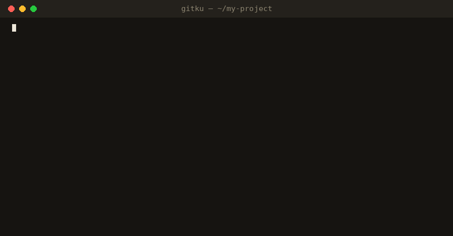

# 🌸 gitku

**Find the accidental haiku hiding in your git history.**

[](https://github.com/pzr6m/gitku/actions/workflows/ci.yml)
[](https://pzr6m.github.io/gitku/)
[](LICENSE)

### [🌸 Find the haiku in your repo →](https://pzr6m.github.io/gitku/)

<p align="center">
  <a href="https://pzr6m.github.io/gitku/"></a>
</p>

Every repository is full of sentences that happen to scan as 5-7-5: a frustrated commit message, a comment written at 2 a.m., a line in the docs. gitku digs them up, credits the author, and turns them into shareable poem cards.

- 🔍 **Finds** haiku in commit messages, code comments and docs
- 🏷️ **Credits** the author, commit and date (`git blame` for files)
- 👑 **Crowns** a poet laureate for the repo
- 🖼️ **Shares**: SVG cards, Markdown, JSON, or PNG from the website
- 📦 **No dependencies**: pure Python 3.9+, plus an optional dictionary for better syllable counts

## Use it

**In the browser:** open [pzr6m.github.io/gitku](https://pzr6m.github.io/gitku/), type `owner/repo` and go. It reads public commits from GitHub's API; nothing is uploaded anywhere else. You can link straight to a result: `https://pzr6m.github.io/gitku/?repo=pallets/flask`.

**In the terminal:**

```bash
git clone https://github.com/pzr6m/gitku && cd gitku
pip install .

gitku                 # scan the repo in the current directory
gitku laureate        # who is this repo's poet laureate?
gitku --loose         # also find haiku hiding inside longer text
```

Needs Python 3.9+ and `git`.

## What now?

- Put a haiku in your README: `gitku --format svg -n 3 -o poems.svg`
- Add the [GitHub Action](#github-action) and get a haiku in every run's summary
- Add the [commit-msg hook](#commit-msg-hook) and be told when you accidentally wrote one
- Send the laureate board to the colleague who wrote "fix it again nobody knows why"

<details>
<summary><b>All commands and options</b></summary>

```bash
gitku [scan] [PATH] [options]
gitku laureate [PATH] [options]
```

| Option | Meaning |
| --- | --- |
| `-n, --limit N` | Show the top N poems; `0` shows all (default 10) |
| `--loose` | Also search inside longer text |
| `--sources commits,comments,docs` | Choose what to scan |
| `--only accidental\|intentional` | Show one kind |
| `--min-score F` | Minimum beauty score (default 0.5) |
| `--since DATE`, `--max-commits N` | Limit how much history is read |
| `--author NAME` | Only poems by authors matching `NAME` |
| `--format text\|markdown\|json\|svg` | Output format |
| `--theme light\|dark` | SVG theme |
| `-o, --output FILE` | Write to a file |

From Python:

```python
from gitku import scan

result = scan.collect(".", loose=True)
for poem in result.poems[:3]:
    print(poem.text, "-", poem.author)
```

For better syllable counts: `pip install ".[accurate]"` (adds the CMU Pronouncing Dictionary).

</details>

<details>
<summary><b id="github-action">GitHub Action</b></summary>

Posts the top haiku to the job summary of every run:

```yaml
- uses: actions/checkout@v4
  with:
    fetch-depth: 0        # gitku reads history
- uses: pzr6m/gitku@main
  with:
    limit: 5
```

Inputs: `path`, `limit`, `loose`, `sources`, `python-version`. Output: `count`.

</details>

<details>
<summary><b id="commit-msg-hook">commit-msg hook</b></summary>

Prints a card when the message you are about to commit is a haiku. It never blocks a commit.

```yaml
# .pre-commit-config.yaml
repos:
  - repo: https://github.com/pzr6m/gitku
    rev: main
    hooks:
      - id: gitku
```

Then run `pre-commit install --hook-type commit-msg`.

</details>

<details>
<summary><b>How it works</b></summary>

| Source | What is scanned |
| --- | --- |
| `commits` | Commit subjects and full messages (merge commits, trailers like `Co-Authored-By`, URLs and `feat(scope):` prefixes are ignored) |
| `comments` | Comment blocks in tracked source files (`#`, `//`, `--`, `/* */`, `<!-- -->` styles) |
| `docs` | Prose paragraphs in tracked `.md`, `.rst`, `.txt` and `.adoc` files (code fences and tables are skipped) |

A piece of text counts as an **accidental** haiku when the *whole thing* splits into exactly 5, 7 and 5 syllables. With `--loose`, any run of words inside longer text can qualify. A haiku whose three lines were already written on three separate lines is labelled **intentional**.

Each accidental haiku gets a **beauty score** between 0 and 1 that rewards natural line breaks: it loses points when a line ends on a word like *the*, *of* or *and*, when a loose haiku starts or stops mid-sentence, or when a poem from a file is cut off before the sentence ends. `--min-score` filters on it, and results are ranked by it.

The website runs the same algorithm in JavaScript (`docs/gitku.js`). A test checks that it agrees with the Python version on syllable counts and haiku windows.

</details>

<details>
<summary><b>Accuracy and limitations</b></summary>

- **Syllable counting is approximate.** English is irregular. Words are looked up in a hand-checked list of developer jargon (`api`, `config`, `refactor`...), then in the CMU Pronouncing Dictionary if you installed the `accurate` extra, then counted by spelling rules. Expect the occasional miscount, especially for names, slang and invented words. Anything containing digits or symbols (`v2`, `foo.py`) can't be counted, so no haiku can include it.
- **Attribution is "last person to touch the line"**, which is what `git blame` reports. It may not be whoever originally wrote the words.
- **The website only reads commit messages** (the most recent 100 to 500), and GitHub limits anonymous API use to 60 requests an hour.
- **English only**, and Python docstrings are not scanned yet.
- Whether something reads as a *good* poem is subjective. The beauty score only measures line breaks.

</details>

<details>
<summary><b>Related projects</b></summary>

[`findahaiku`](https://www.npmjs.com/package/findahaiku) detects haiku in arbitrary text (a library, not a git tool), and `commit-poet` is a Claude Code skill that *writes* poetic commit messages from your diff. As far as I could tell when this was written, nothing mines a repository's existing history for accidental haiku, but I can't rule out that something does.

</details>

<details>
<summary><b>Development</b></summary>

```bash
pip install -e ".[dev]"
pytest
GITKU_NO_CMUDICT=1 pytest                 # dependency-free syllable counter
node --test tests/web/gitku.test.mjs      # the website's engine
python scripts/sync_overrides.py --check  # JS word list matches Python's
python scripts/make_demo_gif.py           # re-record docs/demo.gif
```

See [CONTRIBUTING.md](CONTRIBUTING.md). The demo repository is built by `examples/make_demo_repo.sh`.

</details>

---

<sub>MIT licensed. Made for people who have written "fix" forty times.</sub>
