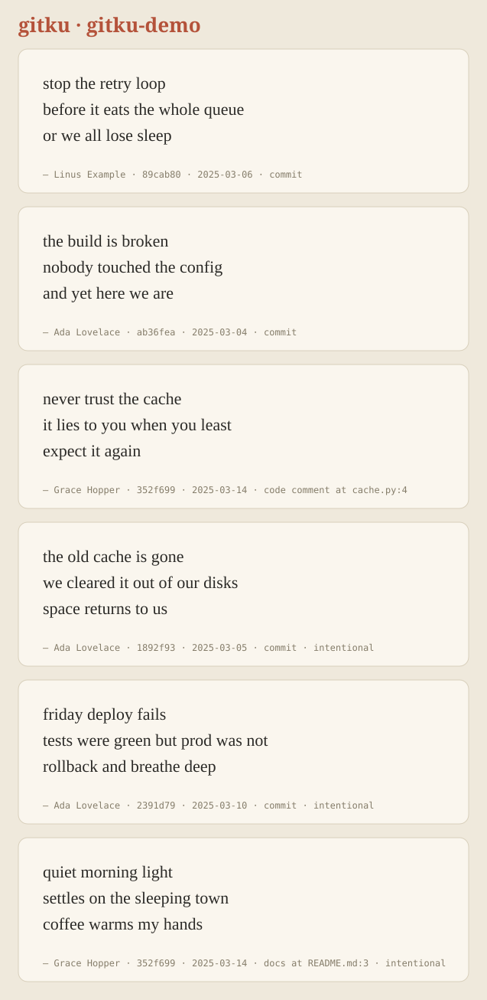

# gitku

**Find the accidental haiku hiding in your git history.**

Every repository is full of sentences that happen to scan as 5-7-5: a frustrated commit message, a comment someone wrote at 2 a.m., a line in the docs. `gitku` digs them up, credits the author, and turns them into shareable poem cards.

<picture>
  <source media="(prefers-color-scheme: dark)" srcset="examples/demo-dark.svg">
  
</picture>

*(Generated from a small fictional repo: `bash examples/make_demo_repo.sh /tmp/demo && gitku /tmp/demo --format svg -n 0 -o poems.svg`)*

## Install

```bash
git clone https://github.com/pzr6m/gitku && cd gitku
pip install .             # no runtime dependencies
pip install ".[accurate]" # optional: use the CMU Pronouncing Dictionary for better syllable counts
```

Needs Python 3.9+ and `git` on your `PATH`.

## Use

```bash
gitku                       # scan the repo in the current directory
gitku path/to/repo -n 20    # top 20 haiku
gitku --loose               # also find haiku hiding inside longer text
gitku laureate              # who is this repo's poet laureate?
gitku --format svg --theme dark -o poems.svg   # a shareable gallery
```

Example output on the demo repo:

```text
╭──────────────────────────────────╮
│  stop the retry loop             │
│  before it eats the whole queue  │
│  or we all lose sleep            │
╰──────────────────────────────────╯
  — Linus Example · 89cab80 · 2025-03-06 · commit

╭─────────────────────────────╮
│  the build is broken        │
│  nobody touched the config  │
│  and yet here we are        │
╰─────────────────────────────╯
  — Ada Lovelace · ab36fea · 2025-03-04 · commit

╭─────────────────────────────────╮
│  never trust the cache          │
│  it lies to you when you least  │
│  expect it again                │
╰─────────────────────────────────╯
  — Grace Hopper · 352f699 · 2025-03-14 · code comment at cache.py:4

...three more, labelled "intentional" because they were already laid out as 5-7-5 lines

3 accidental, 3 intentional haiku (8 commits, 2 files scanned)
```

```text
$ gitku laureate
Poet laureate of gitku-demo

 1. Ada Lovelace ♕  — 1 accidental, 2 intentional  (avg beauty 0.95)
      the build is broken / nobody touched the config / and yet here we are
 2. Grace Hopper  — 1 accidental, 1 intentional  (avg beauty 0.85)
      never trust the cache / it lies to you when you least / expect it again
 3. Linus Example  — 1 accidental  (avg beauty 0.85)
      stop the retry loop / before it eats the whole queue / or we all lose sleep
```

With `--loose`, haiku buried in the middle of a longer message are found too:

```text
╭───────────────────────────────────────╮
│  The logs are quiet,                  │
│  the pager sleeps through the night,  │
│  and nobody weeps.                    │
╰───────────────────────────────────────╯
  — Grace Hopper · a283351 · 2025-03-12 · commit
```

## How it works

`gitku` reads three kinds of text from a repository:

| Source | What is scanned |
| --- | --- |
| `commits` | Commit subjects and full messages (merge commits, trailers like `Co-Authored-By`, URLs and `feat(scope):` prefixes are ignored) |
| `comments` | Comment blocks in tracked source files (`#`, `//`, `--`, `/* */`, `<!-- -->` styles) |
| `docs` | Prose paragraphs in tracked `.md`, `.rst`, `.txt` and `.adoc` files (code fences and tables are skipped) |

A piece of text counts as an **accidental** haiku when the *whole thing* splits into exactly 5, 7 and 5 syllables. With `--loose`, any run of words inside longer text can qualify. A haiku whose three lines were already written on three separate lines is labelled **intentional**.

Each accidental haiku gets a **beauty score** between 0 and 1 that rewards natural line breaks: it loses points when a line ends on a word like *the*, *of* or *and*, when a loose haiku starts or stops mid-sentence, or when a poem from a file is cut off before the sentence ends. `--min-score` filters on it, and results are ranked by it.

Poems found in files are credited using `git blame` on the line where the passage starts.

### Options

| Option | Meaning |
| --- | --- |
| `-n, --limit N` | Show the top N poems; `0` shows all (default 10) |
| `--loose` | Also search inside longer text |
| `--sources commits,comments,docs` | Choose what to scan |
| `--only accidental\|intentional` | Show one kind |
| `--min-score F` | Minimum beauty score (default 0.5) |
| `--since DATE`, `--max-commits N` | Limit how much history is read |
| `--author NAME` | Only poems by authors matching `NAME` |
| `--format text\|markdown\|json\|svg` | Output format |
| `--theme light\|dark` | SVG theme |
| `-o, --output FILE` | Write to a file |

### From Python

```python
from gitku import scan

result = scan.collect(".", loose=True)
for poem in result.poems[:3]:
    print(poem.text, "-", poem.author)
```

## Accuracy and limitations

- **Syllable counting is approximate.** English is irregular. Words are looked up in a hand-checked list of developer jargon (`api`, `config`, `refactor`...), then in the CMU Pronouncing Dictionary if you installed the `accurate` extra, then counted by spelling rules. Expect the occasional miscount, especially for names, slang and invented words. Anything containing digits or symbols (`v2`, `foo.py`) can't be counted, so no haiku can include it.
- **Attribution is "last person to touch the line"**, which is what `git blame` reports. It may not be whoever originally wrote the words.
- **English only**, and Python docstrings are not scanned yet (only `#`-style and similar comments).
- Whether something reads as a *good* poem is subjective. The beauty score only measures line breaks.

## Related projects

`gitku` is a small, playful tool. Some neighbours worth knowing: [`findahaiku`](https://www.npmjs.com/package/findahaiku) detects haiku in arbitrary text (a library, not a git tool), and `commit-poet` is a Claude Code skill that *writes* poetic commit messages from your diff. As far as I could tell when this was written, nothing mines a repository's existing history for accidental haiku, but I can't rule out that something does.

## Development

```bash
pip install -e ".[dev]"
pytest
GITKU_NO_CMUDICT=1 pytest   # test the dependency-free syllable counter
```

See [CONTRIBUTING.md](CONTRIBUTING.md). The demo repository used in this README is built by `examples/make_demo_repo.sh`; `examples/demo-light.svg` and `examples/demo-dark.svg` were generated from it.

## License

[MIT](LICENSE)
